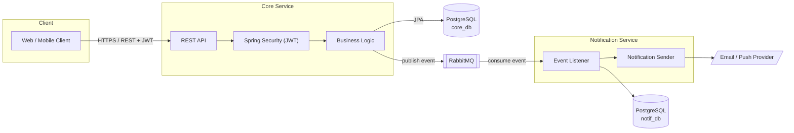
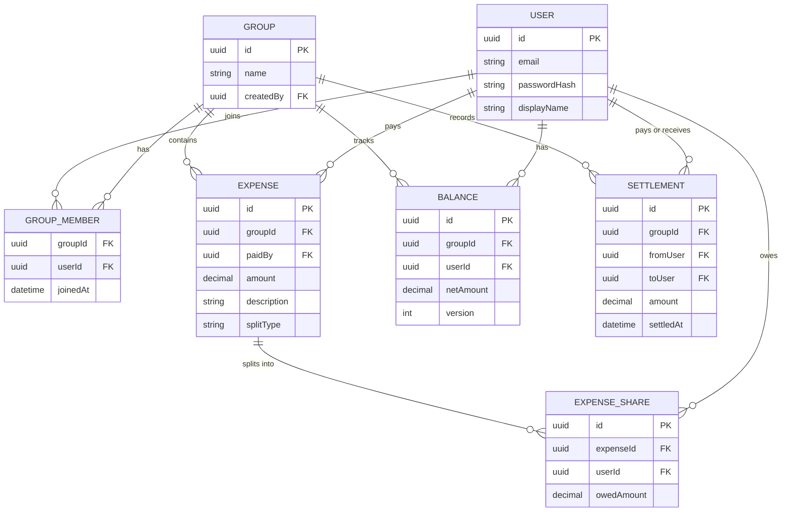
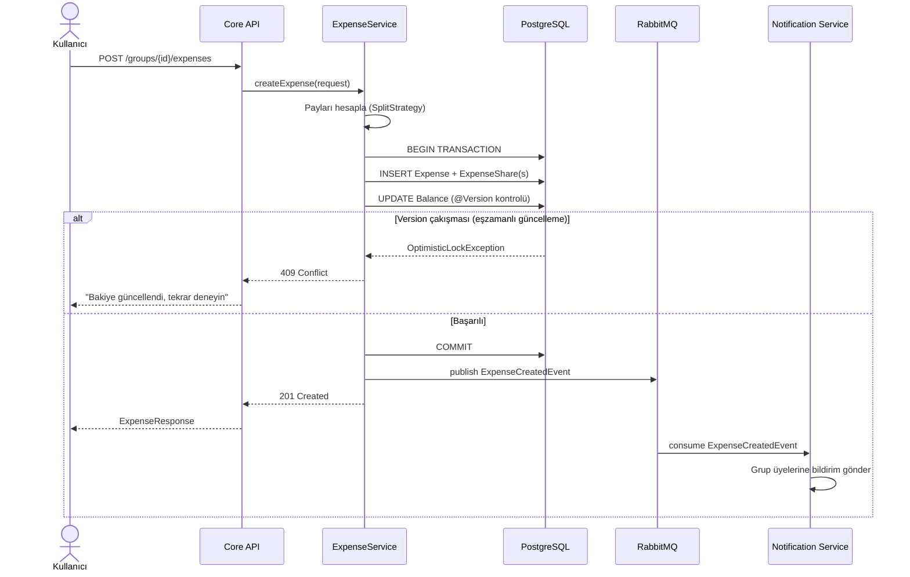

# OrtakPay — Mimari Dokümantasyonu

## 1. Genel Sistem Mimarisi

İki bağımsız servis, RabbitMQ üzerinden asenkron haberleşir. Servisler arasında
senkron (REST) çağrı yoktur — bu bilinçli bir tercihtir: Core Service'in yanıt
süresi Notification Service'in ayakta olup olmamasına bağlı olmamalıdır.

## 2. Veri Modeli (ER Diyagramı)

## 3. Akış: Masraf Oluşturma (Expense Creation)

Bu akış, projenin en önemli teknik konusunu gösterir: **transaction sınırı +
optimistic locking ile concurrency kontrolü.**

## 4. Neden Bu Kararlar? (Mülakat Notları)

| Karar | Alternatif | Neden bu seçildi |
|---|---|---|
| RabbitMQ | Kafka | Yüksek throughput / event replay ihtiyacı yok; sadece güvenilir task delivery gerekiyor |
| Materialized Balance tablosu | Her istekte on-the-fly hesaplama | Gerçek concurrency/transaction problemi yaratıp optimistic locking'i doğal şekilde göstermek için |
| Optimistic locking | Pessimistic locking | Çakışma olasılığı düşük (aynı gruba aynı anda yazma nadir); pessimistic lock gereksiz throughput kaybı yaratır |
| Servisler arası paylaşılan JAR yok | Ortak "common" kütüphane | Coupling'i azaltmak; her servis bağımsız evrimleşebilsin |
| Monorepo | Çoklu repo | Portfolyo projesi için geliştirme/versiyonlama kolaylığı; servisler runtime'da yine bağımsız |
| Testcontainers | H2 in-memory DB | H2, production DB (Postgres) ile davranışsal farklar gösterebilir; Testcontainers gerçek Postgres kullanır |
