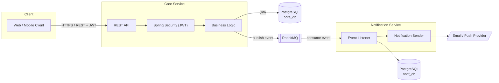

# OrtakPay


OrtakPay, arkadaş grupları arasında ortak masrafları (kira, seyahat, yemek vb.)
adil şekilde paylaştırmayı sağlayan bir masraf paylaşım (expense-splitting)
platformudur — Splitwise benzeri bir ürünün uçtan uca (backend + frontend)
portfolyo kalitesinde ve mülakatta savunulabilir mühendislik kararlarıyla
üretilmesini hedefleyen bir öğrenme projesidir.

## Mimari

İki bağımsız Spring Boot servisi (core-service, notification-service)
RabbitMQ üzerinden asenkron haberleşir; aralarında senkron REST çağrısı
yoktur. Next.js frontend'i sadece core-service'in REST API'sini çağırır.



Veri modeli, akış diyagramları ve mülakat notları için bkz.
[ARCHITECTURE.md](./docs/agent/ARCHITECTURE.md). Tekil teknik kararların
gerekçeleri için bkz. [docs/adr/](./docs/adr/README.md). Geliştirme kuralları
ve faz yol haritası için bkz. [AGENTS.md](./docs/agent/AGENTS.md).

## Teknoloji

| Katman | Teknoloji |
|---|---|
| Backend | Java 21, Spring Boot 4.1.1, Spring Data JPA + Hibernate, Spring Security (JWT), PostgreSQL, Flyway, Spring AMQP (RabbitMQ), springdoc-openapi, Maven |
| Frontend | Next.js 16 (App Router), React 19, TypeScript, TanStack Query, React Hook Form + Zod, Tailwind CSS |
| Test | JUnit 5, Mockito, Testcontainers, AssertJ (backend) · Playwright (frontend e2e) |
| Infra | Docker, Docker Compose, GitHub Actions |

## Proje Yapısı

```
ortakpay/
├── backend/
│   ├── core-service/           # Kullanıcı, grup, masraf, bakiye, settlement, JWT auth
│   └── notification-service/   # RabbitMQ event tüketimi, bildirim gönderimi (mock)
├── frontend/                   # Next.js web arayüzü
├── docs/                       # AGENTS.md, ARCHITECTURE.md, ADR'lar
├── docker-compose.yml          # Postgres x2 + RabbitMQ + backend'in iki servisi
└── e2e-smoke-test.sh           # curl tabanlı hızlı doğrulama script'i
```

## Nasıl Çalıştırılır

### Backend + altyapı (Docker Compose)

```bash
cp .env.example .env   # ilk kurulumda; içindeki şifreleri gerektiği gibi değiştir
docker-compose up --build -d
```

Bu komut core-service, notification-service ve bağımlılıkları olan iki
Postgres + RabbitMQ'yu tek seferde build edip ayağa kaldırır — yerelde
Maven/JDK kurulu olması gerekmez, sadece Docker. `docker-compose ps` ile 5
container'ın da `healthy` olduğunu doğrulayabilirsin (uygulama servisleri
`/actuator/health` üzerinden probe edilir).

Açık portlar:
- `8080` → core-service REST API + Swagger UI
- `15672` → RabbitMQ management UI (`http://localhost:15672`)
- `5434` / `5433` → Postgres (core / notification), sadece debug amaçlı
- `notification-service` **host'a port açmaz** — sadece RabbitMQ üzerinden
  event tüketir

**Swagger UI:** http://localhost:8080/swagger-ui.html

Durdurmak için: `docker-compose down` (veri kalır) veya
`docker-compose down -v` (volume'lar da silinir, temiz sıfırdan başlangıç).

Uçtan uca hızlı bir doğrulama için (`curl` + `jq` gerektirir):

```bash
./e2e-smoke-test.sh
```

### Frontend

Frontend, docker-compose'a dahil değil — backend ayaktayken ayrıca
çalıştırılır:

```bash
cd frontend
npm install
cp .env.local.example .env.local
npm run dev
```

**Frontend:** http://localhost:3000

## Öne Çıkan Mimari Kararlar

- **Optimistic locking, pessimistic değil** — `Balance` tablosu
  materialized tutulur ve `@Version` ile eşzamanlı güncellemelere karşı
  korunur; çakışma olasılığı düşük olduğundan pessimistic lock'un
  throughput maliyeti gereksiz görüldü.
  ([ADR 0004](./docs/adr/0004-materialized-balance-with-optimistic-locking.md))
- **Event-driven bildirim, senkron çağrı değil** — core-service ile
  notification-service arasında hiç REST çağrısı yok; RabbitMQ üzerinden
  asenkron event'lerle haberleşiyorlar, gerçek DB commit'inden sonra
  (`@TransactionalEventListener(AFTER_COMMIT)`) publish edilerek "rollback
  olan işlem için bildirim gitmesin" garantisi sağlanıyor.
  ([ADR 0002](./docs/adr/0002-rabbitmq-over-kafka.md),
  [ADR 0010](./docs/adr/0010-transactional-outbox-lite.md))
- **Resource-based yetkilendirme, rol bazlı değil** — "bu kullanıcı bu
  gruba üye mi?" kontrolü servis katmanında `GroupAccessGuard` ile
  explicit yapılır; `@PreAuthorize` + bir `PermissionEvaluator`'a göre daha
  az "büyülü" ve test edilmesi daha kolay.
  ([ADR 0009](./docs/adr/0009-explicit-service-layer-authorization.md))
- **OpenAPI'den elle üretilen frontend tipleri** — backend'in
  `/v3/api-docs`'undan `openapi-typescript` ile üretilen tipler,
  build/CI adımı değil, manuel bir script; core-service CI'da erişilebilir
  olmadığından bu bilinçli bir tradeoff.
  ([ADR 0012](./docs/adr/0012-manual-openapi-type-regeneration.md))

## Test Durumu

- **Backend:** core-service'te 63, notification-service'te 6 test (unit +
  Testcontainers integration) — her ikisi de her push'ta **GitHub Actions
  CI'da otomatik çalışır** (bkz. `.github/workflows/ci.yml`).
- **Frontend:** Playwright ile yazılmış e2e testleri (`frontend/e2e/`) —
  gerçek bir backend'e ihtiyaç duydukları için CI'da **çalışmıyorlar**,
  yereldeki geliştirme akışının bir parçası (bkz.
  [frontend/e2e/README.md](./frontend/e2e/README.md)). Bu, "ikisi de CI'da
  koşuyor" varsayımına karşı bilinçli bir düzeltme: CI şu an sadece
  backend'i doğruluyor.

## Bilinçli Olarak Yapılmayanlar

Bu bir portfolyo/öğrenme projesi olduğu için bazı production-grade
davranışlar bilinçli olarak ertelendi — her biri neden ve ne zaman
eklenmesi gerektiğiyle birlikte bir ADR'da belgelendi:

- **`Balance.getOrCreate`'in ilk-insert race'i ele alınmadı** — bu ölçekte
  olasılığı düşük; ölçek büyürse iki bilinen çözümden biri uygulanabilir.
  ([ADR 0008](./docs/adr/0008-balance-get-or-create-race-condition.md))
- **Notification consumer'ları idempotent değil** — RabbitMQ at-least-once
  teslimat garantisi verir, `NotificationListener` aynı mesajın tekrar
  teslim edildiğini ayırt etmiyor; nadiren (ack öncesi çökme senaryosunda)
  `NotificationLog`'a duplicate bir satır düşebilir. Şu an sadece mock bir
  log satırı etkileniyor, gerçek bir email/push provider eklenince mesaj ID'si
  üzerinde UNIQUE constraint + "already processed" kontrolü gerekecek.
  ([ADR 0011](./docs/adr/0011-notification-consumer-not-idempotent.md))
- **`@Scheduled` job'ları dağıtık kilit içermiyor** — core-service tek
  instance çalıştığı sürece sorun değil; yatay ölçeklenirse ShedLock gibi
  bir DB-tabanlı kilit eklenmeli.
  ([ADR 0013](./docs/adr/0013-scheduled-job-single-instance-limitation.md))
